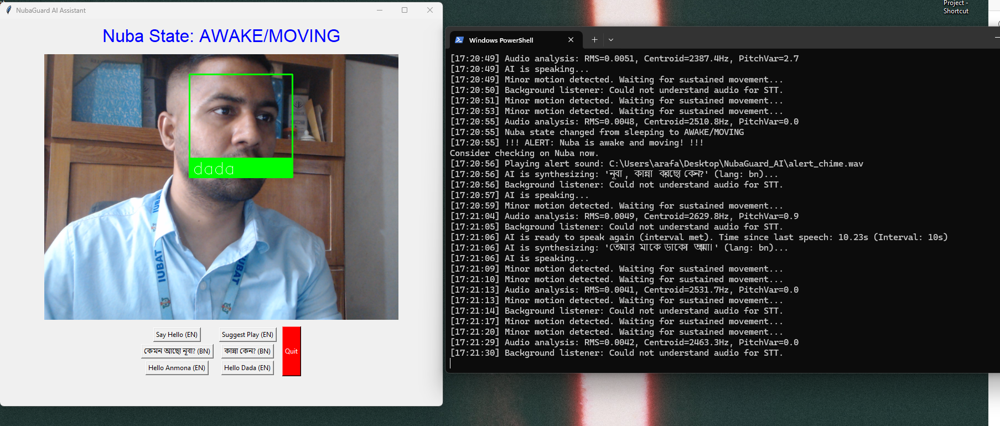

# NubaGuard AI Assistant



## Project Overview

NubaGuard is a personal AI assistant designed to help parents monitor and interact with their baby. Developed with a focus on safety, engagement, and modern AI capabilities, it offers real-time monitoring, intelligent conversational features, and visual recognition.

This project was developed step-by-step with the guidance of a Google AI assistant, showcasing the power and accessibility of Google's AI technologies for practical applications.

## Features

- **Real-time Visual Monitoring:** Live camera feed via a Tkinter GUI for continuous observation.
- **Motion Detection:** Identifies significant movement (e.g., baby waking up) with configurable sensitivity.
- **Intelligent State Management:** Tracks baby's state (Sleeping/Awake/Moving) with smart sleep detection and gentle "Good night" messages.
- **Safety Alerts:** Triggers audio alerts (e.g., a chime) when the baby transitions to an awake state.
- **Basic Cry Detection:** Utilizes audio feature analysis to identify potential crying sounds.
- **Advanced Conversational AI (Powered by Google Gemini API):**
  - Text-to-Speech (English & Bengali) for proactive interaction and responses.
  - Background Speech-to-Text for "listening" without interrupting monitoring.
  - **Contextual Responses:** Leverages Gemini (`gemini-1.5-pro`) to generate dynamic, baby-appropriate replies based on recognized speech and detected objects.
- **Visual Recognition:**
  - **Face Recognition:** Identifies known individuals (baby, mother, father) and provides personalized greetings.
  - **Object Detection (YOLOv3-tiny):** Identifies common objects in the environment (e.g., bottle, toy, book), providing visual context for AI responses.
- **Data Logging:** Records key events (wake-ups, sleep, AI interactions, recognized speech) to a CSV file for future analysis and "self-learning" insights.
- **User-Friendly GUI:** An intuitive Tkinter interface for easy monitoring and control.

## How It Works

NubaGuard leverages several advanced AI and computer vision techniques:

- **OpenCV:** For video processing, motion detection, and drawing overlays.
- **`face_recognition` library:** For face detection and identification (built on dlib).
- **YOLOv3-tiny (via OpenCV DNN):** For real-time object detection.
- **`speech_recognition` & `PyAudio`:** For capturing audio from the microphone and converting speech to text.
- **`gTTS` & `playsound`:** For synthesizing and playing AI speech.
- **Google Gemini API:** The core intelligence for natural language understanding and generation, providing contextual responses.
- **`librosa` & `soundfile`:** For advanced audio feature extraction (used in cry detection).
- **`Tkinter` & `Pillow`:** For the graphical user interface.
- **`threading`:** To enable concurrent operation of video processing, audio listening, and AI logic.

## Setup and Installation

1. **Clone the Repository:**
   ```bash
   git clone https://github.com/elaichix/NubaGuard_AI.git
   cd NubaGuard_AI